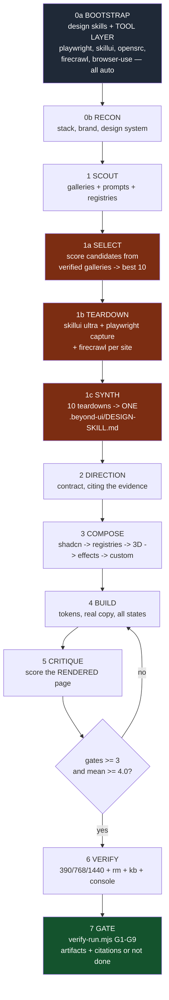
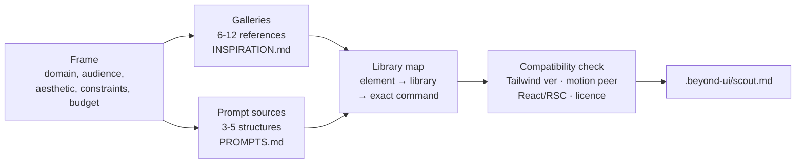
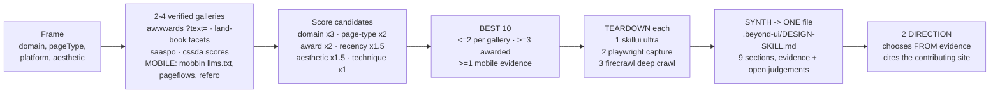
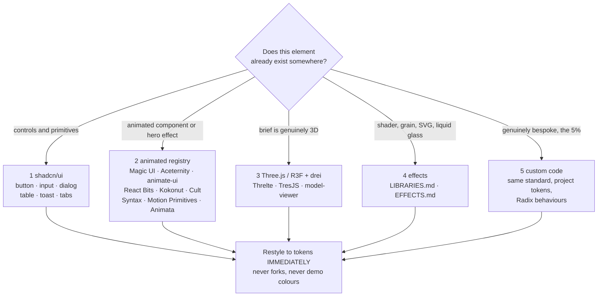
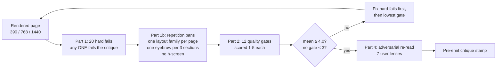

# beyond-ui — how it works (v2)

A skill that makes a coding agent produce UI a working designer would sign their name to.

It is **not** a prompt that says "make it beautiful". It is a **pipeline with gates**: the agent must
install the upstream design skills AND the capture tool layer (nothing is ever installed by hand),
select the best 10 award-winning references for this exact project, tear each one down into a
machine-readable design system, condense the 10 into one binding project skill, compose from
libraries that already solved the hard parts, then prove the result was rendered, scored and cited —
or the run is not done.

The agent's opinions are deliberately constrained at every step. That is the whole design.

---

## 1. The three failures it exists to kill

| Failure | What it looks like |
|---|---|
| **AI slop** | Centred hero, three feature cards with emoji icons, Inter everywhere, purple→blue gradient, `transition-all duration-300` on everything, `rounded-2xl bg-white/10 backdrop-blur` |
| **Skipping the scout** | Agent writes CSS from scratch "because it's faster than looking anything up". It is not faster. It is how failure 1 happens |
| **Invisible evidence** | Agent runs the skill, installs hallmark/impeccable, writes a scout file… then builds from its prior and cites none of it. Fixed by the citation log + `scripts/verify-run.mjs` |

Every rule in the skill traces back to one of these three.

---
## 2. The big picture — v2 pipeline



**What changed in v2:** the scout's *outside* look (gallery cards) is now backed by an *inside* look
(teardown). Phases 1a–1c take 25–40% of the task budget — real work, not a formality.

### 0a. Bootstrap — upstream skills + tool layer, all automatic

```bash
node scripts/bootstrap-upstream-skills.mjs            # project scope
node scripts/bootstrap-upstream-skills.mjs --global   # user scope
node scripts/bootstrap-upstream-skills.mjs --check    # report only
```

What it installs, by mechanism:

| Mechanism | Skills |
|---|---|
| `npx skills add` (CLI-native) | Vercel: `web-design-guidelines`, `react-best-practices`, `composition-patterns`, `react-view-transitions`, `react-native-skills` · Addy Osmani: `frontend-ui-engineering` · Anthropic: `frontend-design`, `skill-creator` |
| `git clone` + copy `SKILL.md` | `impeccable`, `hallmark`, `ui-ux-pro-max`, `taste`, `bencium-design`, `accesslint`, `refactoring-ui` |
| Clone, no `SKILL.md` found | Kept as **reference material** in `.beyond-ui/upstream/` — the script never pretends an install happened |

**Decision at this step:** if something fails to install, the agent must fetch that skill's raw
`SKILL.md` URL and read it, then record the miss in `.beyond-ui/state.json` → `skills.missing`
with `{name, reason, readInstead}`. Claiming compliance with a skill that was never fetched is a
**hard fail**. The script `exit(1)`s on failure precisely so this cannot be silently ignored.

**v2 — the tool layer installs in the same step** (non-negotiable 8, `scripts/install-tools.mjs`):

| Tool | Role | Skip-if-present check |
|---|---|---|
| playwright + chromium | deep capture engine + VERIFY renderer | package resolvable from the project **and** chromium binary in `%LOCALAPPDATA%/ms-playwright` (two separate checks) |
| `skillui@1.3.4` (github.com/amaancoderx/npxskillui) | per-site design-system extraction (tokens, keyframes, scroll journeys, interaction diffs) | npx-cached / global probe |
| `opensrc` (vercel-labs/opensrc) | read any npm package's real source when a registry needs verifying | `npx --no-install opensrc --version` |
| `firecrawl-cli` + official firecrawl skills (github.com/firecrawl/cli) | deep content crawl (`scrape`/`map`/`deep`) | key-gated: env `FIRECRAWL_API_KEY` → project config; **no key ships with the repo — no key = skipped, never a blocker** |
| `lackeyjb/playwright-skill` (GitHub) | Playwright automation skill for the agent | skill dir present |
| `browser-use` (bmaltais/browser-use-skill) | **optional** LLM-driven agent for bot-walled/login-gated sites only — never for deterministic capture | skill dir present |

Every step detects before installing; a globally-installed tool is never reinstalled. Chromium is the
only hard requirement — the installer exits 1 without it so degraded runs are loud, not silent.

### 0b. Recon — read the project before deciding anything (≤ 10 tool calls)

```bash
node scripts/scaffold-state.mjs      # creates .beyond-ui/state.json + .beyond-ui/scout.md
```

Creates the run's state files from `assets/`, **without overwriting an existing run** (idempotent —
re-running keeps your work).

Then the agent reads, in this order: framework + version, Tailwind version, whether
`components/ui` + `components.json` already exist, the tokens/theme file, font loading, image
pipeline, animation deps in `package.json`, and the actual product domain.

**Why this step decides everything:**

```
Tailwind v4 project + a v3 registry snippet   → silently loses all styling
motion project + a framer-motion registry     → installs a second, conflicting motion library
shadcn already customised + `shadcn init`     → overwrites the token system (destructive)
```

Every scout result is filtered by these findings. This is the single most common copy-paste break.

### 1. Scout — evidence collection, not "looking at pretty websites"

Protocol: `references/SCOUT.md`. Source universe: **60+ galleries, 55+ prompt/template sources,
40+ component registries, 45+ libraries**.



What actually happens:

1. **Write the 5-line frame first.** Without it, scouting degenerates into bookmarking 30 beautiful
   sites that have nothing to do with the product.
2. **Open 4–8 *different kinds* of gallery**, mixing an award gallery (awwwards/FWA/CSSDA), a curated
   directory (land-book/siteinspire/minimal.gallery/Refero), a motion showcase (motionsites.ai,
   hoverstat.es, Codrops) and a domain-specific one (Mobbin for app flows, SaaSpo for SaaS marketing,
   21st.dev / threejsresources for technique-level work). Prefer sources with **agent surfaces**
   (`.md` twins, `llms.txt`, MCP, OpenAPI) so the agent reads structure as text instead of guessing
   from pixels.
3. **Extract structure, not pixels.** Per reference it records: URL · what is taken · technique
   observed · what is deliberately *not* taken. A section grammar is craft; a whole-site clone is
   plagiarism.
4. **Harvest 3–5 prompt templates** for the section inventory and content shape. Use the skeleton,
   rewrite every line, discard the adjectives.
5. **Map every element to a library that already ships it**, with the exact command.

**The gate:** if ≥ 70% of elements on the page are hand-written, the scout was not done. Every
"we'll just build it" needs a real reason (licence / bundle / incompatibility / genuinely bespoke).

Output — `.beyond-ui/scout.md`, and `Rejected` is **not optional** (it proves the scout was real and
stops the direction being re-litigated mid-build):

```
Frame · Bootstrap evidence · Tool layer evidence · Direction · References (6–12) · Prompts (3–5)
Library map · 3D section · Teardown synthesis · Rule citations · Design contract · Rejected · Risks
```

### 1a–1c. Select → Teardown → Synthesize (NEW in v2)

Protocol: `references/TEARDOWN.md`. The scout looks at references from the outside; the teardown
opens them up and reads their design systems from the inside.



**1a SELECT — a rubric, not vibes.** Candidates are scored from 2–4 *verified fetchable* galleries
(all plain-HTTP confirmed; the full table with URL grammars is in `assets/config.json` → galleries).
Mobile-app projects switch primaries: Mobbin (`llms.txt` + MCP) · Page Flows (`/ios/`, `/android/`) ·
Refero. Diversity constraints: ≤2 per gallery, ≥3 with an explicit award signal, ≥1 with mobile
evidence. Output: `.beyond-ui/references-selection.json` — per-site score, award, why — the audit
trail for why THESE 10.

**1b TEARDOWN — three independent layers per site** (each has a skip flag; any layer failing does
not kill the others):

| Layer | Produces |
|---|---|
| `skillui@1.3.4 --mode ultra` | `SKILL.md` + `references/{DESIGN,ANIMATIONS,LAYOUT,COMPONENTS,INTERACTIONS}.md` + `tokens/*.json` + `screens/{scroll,pages,sections,states}/` — the per-site "clone-1:1" skill file |
| `scripts/capture-site.mjs` (playwright) | `capture.json`: :root tokens, loaded fonts, every `@keyframes`, transitions in use, computed styles, section inventory, motion-library detection, hover/focus diffs via CDP `forcePseudoState`, shots at 390/768/1440 |
| `scripts/firecrawl.mjs deep` (optional, key-gated) | `content.md` + top same-origin pages — the real copy structure |

Status is recorded honestly per site: `ultra` / `degraded` / `static` / `failed`. A site failing both
skillui and capture is replaced by the next-best candidate.

**1c SYNTH — 10 skill files condensed into ONE.** `node scripts/teardown.mjs synth` writes
`.beyond-ui/DESIGN-SKILL.md`: extracted colour/type/spacing/motion/structure evidence, per-site
deep-dives, **the judgements still open** (what the agent must still decide), and the hard limits
that still apply. Synthesis is *evidence, not a decision* — DIRECTION still chooses, but from
extracted easing curves and spacing bases instead of vibes, citing the contributing site per choice.

**Plagiarism boundary (unchanged):** steal grammar — easing curves, section order, state behaviour,
type pairing. Never identity: copy, logos, imagery, illustration style, a full visual identity.
   plagiarism.
4. **Harvest 3–5 prompt templates** for the section inventory and content shape. Use the skeleton,
   rewrite every line, discard the adjectives.
5. **Map every element to a library that already ships it**, with the exact command.

**The gate:** if ≥ 70% of elements on the page are hand-written, the scout was not done. Every
"we'll just build it" needs a real reason (licence / bundle / incompatibility / genuinely bespoke).

Output — `.beyond-ui/scout.md`, and `Rejected` is **not optional** (it proves the scout was real and
stops the direction being re-litigated mid-build):

```
Frame · Bootstrap evidence · Direction · References (6–12) · Prompts (3–5)
Library map · 3D section · Design contract · Rejected · Risks
```

### 2. Direction — the design contract (binding)

Two things, in this order.

**First, the Design Read** — one line, before any code:

> *"Reading this as: B2B SaaS landing for technical buyers, with a Linear-style minimalist language
> and one kinetic moment in the hero."*

If the brief is ambiguous about something that changes the design, the agent asks **exactly one
question** rather than guessing wide.

**Then the contract** — the file the rest of the build obeys:

| Field | Must contain | Banned |
|---|---|---|
| Aesthetic name | One specific phrase ("Swiss editorial on warm paper", "dense terminal brutalism") | "modern and clean" |
| Type | Display + body + mono, with the exact loading strategy | System stack or Inter *as the display face*; 4+ families |
| Colour | Real values (OKLCH preferred): neutral ramp, one accent, one signal, elevation strategy | Purple-on-dark gradient default; pure `#000`/`#fff`; untinted greys |
| Spacing & rhythm | Scale, section rhythm, content width, grid | Uniform `py-24` between every section |
| Motion | Easing set, durations, entrance grammar, scroll behaviour, reduced-motion fallback | Decorative-only motion; bounce/elastic easing |
| References | 3+ real sites this direction derives from | Vibes |
| Non-goals | What this design deliberately will not do | — |

Mid-build deviation from this contract is why pages end up with five competing aesthetics.

### 3. Compose — fixed order, and the order *is* the point



Rules that come with the order:

- **shadcn/ui is the base** for every control. Raw `<button>`, `<input>`, `<dialog>` and hand-built
  dropdowns are a **defect, not a style choice**. It is chosen because it is *source you own* built on
  Radix — correct focus traps, `aria-expanded`, escape handling, keyboard nav for free — and because
  it is the lingua franca that makes every other registry composable.
- **One aesthetic, 2–3 registries.** The direction contract names which ones are in play. Installing
  eight animated components that don't share an aesthetic is "registry roulette".
- **Restyle to tokens the moment it lands.** A registry component shipped with its demo colours is
  slop. Map colours/spacing/radius to project tokens before committing.
- **Prune.** Remove installed-but-unused components; they carry deps and CSS weight.
- **Documented exceptions only** for leaving shadcn (Vue/Svelte → shadcn-vue/svelte; RN →
  react-native-reusables; genuinely absent primitive → compose Radix in shadcn style). The exception
  is never "it was quicker to write a div".

**3D gets its own gate** (`references/THREEJS.md`) before anything is installed:

| Situation | Verdict |
|---|---|
| Product is physical/styled/configurable; concept *is* the visual; genuine spatial data | **Yes** |
| "It would look cool" on a lead-gen or pricing page; dashboard UI | **No** — use ShaderGradient or a real screenshot |

*If you removed the 3D and the page still said the same thing, remove the 3D.* One engine per project,
never mixed. Assets go through `gltfjsx --transform` → Draco + KTX2, with a static poster that is the
LCP element.

### 4. Build

- Tailwind utilities **bound to tokens**; no magic hex in JSX. Dark mode is a token swap, not a second
  stylesheet.
- **Real states**: loading (skeletons matching the real geometry), empty (with a real next action),
  error, partial, offline, permission-denied. A page with only the happy path is unfinished.
- **Responsive by construction**: design 390px, then 768px, then wide. Reflow intentionally — never
  let the desktop layout shrink.
- **Accessibility is not a polish step**: semantic landmarks, one `h1`, labelled controls, visible
  focus, contrast ≥ 4.5:1 in both themes, keyboard-complete flows.
- **Real copy.** Lorem, "Empower your workflow", and unnamed customer logos are defects. If a metric
  or logo doesn't exist, ship an honest gap instead of inventing proof.

### 5. Critique — scored against the **rendered page**, not the source

Source review cannot see specificity fights, contrast failures over gradients, focus order, or rhythm.
The agent screenshots the full page at 390/768/1440 and scores from the images + live DOM.



**Hard fail examples** (mechanically checkable, 20 total): template smell · gradient-text headlines ·
three equal columns / card-in-card · placeholder content · default type · pure black/white and
untinted neutrals · emoji icons · `transition: all` · decorative-only or absent motion · re-drawn
browser/phone chrome · broken states · mobile-as-a-shrink · a11y floor missed · invented proof ·
unlocked tokens · CTA intent duplication · perf regression.

**Quality gates (1–5):** hierarchy · type · colour · rhythm & space · layout · motion · craft detail ·
content · states · distinctiveness · restraint · system coherence.

**Threshold:** no gate below 3, **mean ≥ 4.0** for "designed", **≥ 4.5** for "portfolio-grade".

**Part 4 re-reads the page as**: a first-time visitor on a phone on 4G · a skeptic · someone who
wants to act now · a keyboard-only user · a screen-reader user · a maintainer · a designer with taste.

### 6. Verify — a UI change is done when it was observed

| Check | Pass condition |
|---|---|
| Render | Screenshots at 390 / 768 / 1440 (plus the project's real breakpoints), visually inspected |
| Reduced motion | With `prefers-reduced-motion: reduce`, nothing critical disappears, no layout breaks |
| Keyboard | Full interactive flow reachable and operable; focus visible throughout |
| Console | No new errors/warnings; no hydration mismatches |
| Perf smoke | No new long tasks on load; hero animation does not regress LCP; no CLS from late fonts/images |
| 3D (when present) | Poster is LCP; scene paused off-screen; frozen under reduced motion; asset bytes + throttled FPS recorded |
| Token discipline | No raw hex/`px` outside tokens; dark mode verified |
| Registry integrity | Every added registry component still compiles; unused ones removed |

### 7. Gate — `scripts/verify-run.mjs` (NEW in v2)

The run's final step is mechanical, not narrative. Nine gates, all must pass, exit 1 otherwise:

| Gate | Checks |
|---|---|
| G1 | `state.json` present + parseable |
| G2 | scout.md cites ≥4 URLs + has a library map |
| G3 | upstream skills installed, or each miss carries a `readInstead` URL |
| G4 | selection: ≥6 references, ≥3 awarded, all scored |
| G5 | teardown: ≥6 sites with real artifacts (tokens/screens/capture/content) |
| G6 | DESIGN-SKILL.md synthesized with all 9 sections |
| G7 | rule citations ≥5, each `{decision, source, appliedIn}` — the anti-"ignored the skills" gate |
| G8 | critique recorded: 12 gates, none <3, mean ≥4.0 |
| G9 | verify evidence: 3+ real screenshots + reduced-motion + keyboard + console pass |

A failing gate is remedied by **doing the missing work** — never by relaxing the gate or editing
`state.json` by hand. Full contract: `references/USAGE.md`.

---

## 4. Where the rules come from

The skill inherits its non-negotiables from the upstream skills it installs, and states the rulings
when they conflict (`references/SKILLS.md`):

| Upstream | What beyond-ui inherits |
|---|---|
| **impeccable** | Tinted neutrals, no card-in-card, no bounce easing, iterate on the rendered page |
| **hallmark** | Structural variety, the slop test, six-axis pre-emit self-critique, honest copy, locked tokens, 8 states per component |
| **ui-ux-pro-max** | Brief → pattern/style/palette/pairing must be *selected*, not invented; token architecture |
| **taste-skill** | Design Read first, anti-default discipline, palette rotation, layout-repetition bans, max 1 eyebrow per 3 sections |
| **Anthropic frontend-design** | One orchestrated moment, spend boldness in one place, the brief's own words win |
| **Addy Osmani** | Spacing scale discipline, semantic tokens, real `<button>`, skeletons over spinners |
| **Vercel guidelines** | `focus-visible` replacement, no `transition: all`, `tabular-nums`, `text-wrap: balance`, never block paste, destructive actions confirm |
| **bencium** | Commit fully to one named aesthetic; deliberate anti-sameness |
| **accesslint** | Findings carry an evidence basis (verified / confirm-with-human / human-required); audit the rendered DOM |
| **refactoring-ui** | Hierarchy → spacing → type → colour → clutter → empty states ordering |

Conflict rulings that win: **shadcn/ui is the base**; Inter banned as the *display* choice; gradient
text banned; centred hero only when the message itself is the design; invented metrics/logos never;
one icon library per project; WCAG 2.2 AA is a floor aesthetics may not trade away.

---

## 5. What the coding agent gets at the end

The deliverable is not "a page". It is **code plus the evidence trail** that explains and defends it.
This is what stops the next agent (or the human) from drifting back into slop.

```mermaid
flowchart TD
    OUT["beyond-ui run output"] --> ART["Artifacts"]
    OUT --> CODE["Code"]
    OUT --> REP["Report"]

    ART --> A1[".beyond-ui/scout.md<br/>references, library map,<br/>rejected, risks<br/>the design's justification"]
    ART --> A6[".beyond-ui/DESIGN-SKILL.md<br/>NEW v2: the ONE condensed skill<br/>synthesized from the 10 teardowns"]
    ART --> A5[".beyond-ui/teardown/<br/>NEW v2: 10 per-site design systems<br/>tokens, keyframes, screens,<br/>interaction diffs"]
    ART --> A2[".beyond-ui/state.json<br/>tools, selection, teardown manifest,<br/>rule citations, gates, evidence"]
    ART --> A3["Screenshots<br/>390 / 768 / 1440 (+ both themes)"]

    CODE --> C1["shadcn primitives in components/ui"]
    CODE --> C2["registry components, restyled to tokens"]
    CODE --> C3["token file in CSS (v4) or config (v3)"]
    CODE --> C4["bespoke code for the 5% only"]

    REP --> R1["Design Read line"]
    REP --> R2["Files touched · libraries used"]
    REP --> R3["Hard fails fixed · gate mean"]
    REP --> R4["Checks run + results · deferred"]
    REP --> R5["Critique stamp:<br/>P5 H4 E5 S4 R5 V5"]
```



### The report format (≤ 8 lines)

```
DESIGN READ <one line: surface, audience, aesthetic language>     # written before any code
DIRECTION   <aesthetic name + 1 line>
LIBRARIES   <registries used, with which elements>
HARD FAILS  <count> fixed: <list, or "none">
GATES       mean <x.x>; lowest: <gate> <score>
EVIDENCE    <screenshot paths, viewport set, reduced-motion + keyboard results>
DEFERRED    <what and why>
/* beyond-ui · critique: P5 H4 E5 S4 R5 V5 */
```

The last line is the **six-axis pre-emit critique stamp**: Philosophy, Hierarchy, Execution,
Specificity, Restraint, Variety. **Anything below 3 forces a revision pass** — the work is not done.
A low `V` (Variety) means the same macrostructure was reused; the fix is a different layout family or
palette band, not a different accent colour.

### Why this is what a coding agent needs

- **`scout.md` replaces taste.** The agent now has named URLs, a stolen structure, and an install
  command per element instead of inventing a layout from its prior.
- **`DESIGN-SKILL.md` replaces vibes with measurements** (NEW v2). Type pairings, accent roles,
  keyframe vocabularies and spacing bases come from extracted tokens of sites that already won —
  the agent chooses from evidence, then *cites which site* justified each choice.
- **The contract replaces drift.** Type, colour, spacing and motion are already decided, so
  mid-build choices get checked against a written rule instead of a feeling.
- **The library map replaces hand-rolling.** Each element has an owner that already solved the hard
  parts (focus traps, aria, layout animation, GLTF compression).
- **The critique stamp replaces "looks good".** A number on six axes, with a re-render as proof, and
  a revision loop that does not exit below 3.
- **`state.json` + `ruleCitations` replace memory** (NEW v2). The citation log is the mechanical answer
  to "the agent ran the skill but ignored everything" — G7 fails the run without it.
- **`verify-run.mjs` replaces "done".** Exit 0 is the only stop condition; every gate names the
  missing work otherwise.
## 6. Files in this skill

```
beyond-ui/
  SKILL.md                      # the workflow + non-negotiables (this README explains it)
  README.md                     # ← you are here
  scripts/
    bootstrap-upstream-skills.mjs   # phase 0a — upstream skills + tool layer (.sh for POSIX)
    install-tools.mjs               # tool layer: playwright, skillui, opensrc, firecrawl, browser-use
    scaffold-state.mjs              # phase 0b — create .beyond-ui/{state.json,scout.md}
    teardown.mjs                    # phases 1a–1c — init / run / synth (SELECT → TEARDOWN → SYNTH)
    capture-site.mjs               # deep capture: tokens, keyframes, states, shots at 3 viewports
    firecrawl.mjs                  # firecrawl bridge: scrape / map / deep (key-gated, soft-fail)
    verify-run.mjs                 # phase 7 — enforcement gate G1–G9
  assets/
    state-template.json         # run state: tools, selection, teardown, synthesis, citations, gates
    scout-template.md           # the scout artifact to fill in
    config.json                 # run config template: verified gallery table + firecrawl key slot (set your own)
    registry-sources.json       # machine-readable registry + npm facts (versions, verified dates)
  references/                   # loaded on demand when the run reaches that step
    SCOUT.md          source universe + protocol + scout.md schema
    TEARDOWN.md       NEW v2 — select 10 / teardown 10 / synthesize 1 protocol + rubric
    USAGE.md          NEW v2 — citation contract + the enforcement gate
    INSPIRATION.md    60+ galleries, award sites, motion showcases
    PROMPTS.md        55+ template/prompt sources
    COMPONENTS.md     40+ registries, namespaces, exact install commands
    LIBRARIES.md      45+ libraries: install facts, framework support, licence
    EFFECTS.md        WebGL, shaders, SVG, liquid glass, grain, text effects
    THREEJS.md        3D decision gate, library choice, scene patterns, asset pipeline
    SHADCN.md         setup, theming, tokens, extension, when NOT to use it
    MOTION.md         easings, durations, patterns, Motion/GSAP/Anime/Lenis choice
    DESIGN.md         type, colour, space, hierarchy craft rules
    CONTENT.md        copy, content shape, microcopy, SEO/OG surface
    A11Y-PERF.md      WCAG 2.2 AA floor + Core Web Vitals budgets
    STACKS.md         per-stack recipes (Next, Vite, Astro, Svelte, Vue, React Native)
    CRITIQUE.md       20 hard fails + repetition bans + 12 scored gates
    SKILLS.md         upstream skills, install matrix, conflict rulings
    EXAMPLES.md       4 worked end-to-end walkthroughs
  evals/evals.json   7 realistic prompts for with-skill vs without-skill comparison
```

---

## 7. Quick start

```bash
# from the target project — everything self-installs, skip-if-present
node <skill>/scripts/bootstrap-upstream-skills.mjs   # 0a: upstream design skills + TOOL LAYER
node <skill>/scripts/scaffold-state.mjs              # 0b: run state
node <skill>/scripts/teardown.mjs init               # 1a: scaffold the selection file
# … agent: frame + score galleries -> pick the best 10 -> fill references-selection.json …
node <skill>/scripts/teardown.mjs run                # 1b+1c: teardown 10 -> synthesize DESIGN-SKILL.md
# then follow SKILL.md: direction -> compose -> build -> critique -> verify
node <skill>/scripts/verify-run.mjs                   # 7: enforcement gate — or the run is not done
```

Firecrawl (optional deep crawl): **no key ships with this repo.** The key resolves from env
`FIRECRAWL_API_KEY` → the project's `.beyond-ui/config.json` (`"firecrawlApiKey": "fc-…"` — get one
at firecrawl.dev). No key anywhere = firecrawl skips silently and the pipeline continues on
Playwright + plain HTTP.

Trigger phrases that should start it: `beyond-ui`, `no AI slop`, `make it beautiful`,
`award-winning`, `awwwards level`, `design a landing page`, `build the UI`, `redesign this page`,
`it looks AI generated`, `add animations`, `polish the UI`.

**Stop condition:** `scripts/verify-run.mjs` exits 0 — rendered, screenshotted, keyboard- and
reduced-motion-verified UI; critique gates all ≥3 with mean ≥4.0; a clean six-axis stamp; ≥5 rule
citations; the 10-reference teardown and the synthesized DESIGN-SKILL.md on disk. Anything else is
still a revision pass owed.
